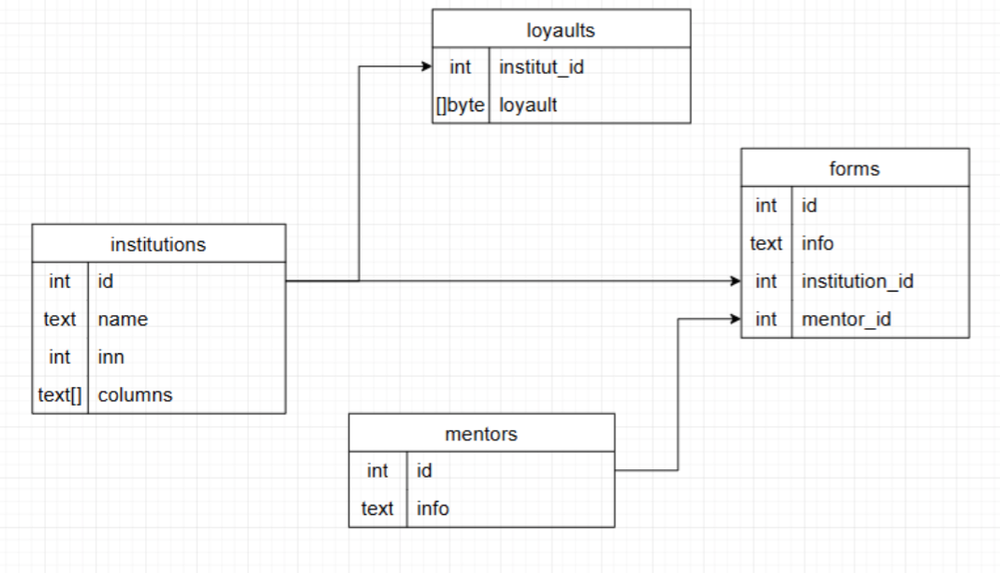
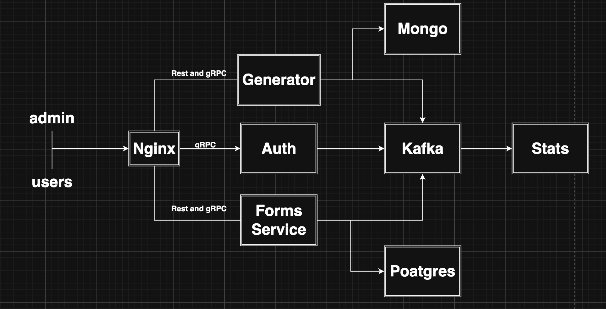

## Описание:
Данный проект создает, редактирует, удаляет шаблоны договоров иснтитутов и так же формы для заполнения таблиц.

Он разделен на несколько сервисов:
Forms - занимается сбором и редактированием форм институтов
Generator - принимает шаблоны и генерирует таблицы
Auth - проверяет является ли пользователь админом при редактировании
Stats - собирает логи со всех сервисов

В папке depoy находятся все переменные окружения и docker-compose конфигурация для запуска

Nginx - веб сервер который связывает все сервисы, проксирует как rest так и grpc

так же есть .github конфигурация для работы и развертывания сервиса через Github Actions


## Запуск проекта:

```bash
    git clone https://github.com/TATAROmangol/npc_ric 
    cd npc_ric/deploy
    docker-compose build
    docker-compose up -d
```


## Реализация:
1. Rest: https://documenter.getpostman.com/view/44661306/2sB2xBDVvX
2. Схема БД:
    <div style="text-align: center;">
        
    </div>
3. Архитектура приложения:
    <div style="text-align: center;">
        
    </div>

